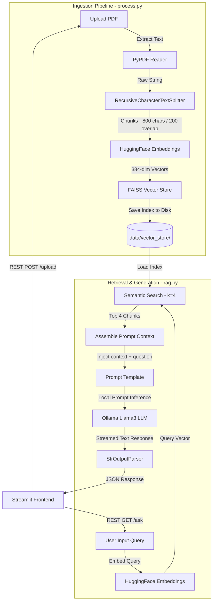

# SmartPDF-Retriever

> 📄 **Precursor Project**: Early exploration of local Retrieval-Augmented Generation (RAG) that laid the architectural foundation for **[Simplify](https://github.com/joel8779/simplify)**.

[](https://www.python.org/)
[](https://fastapi.tiangolo.com/)
[](https://streamlit.io/)
[](https://www.langchain.com/)
[](https://ollama.com/)
[](LICENSE)

SmartPDF-Retriever is a full-stack, local Retrieval-Augmented Generation (RAG) application that allows users to upload PDF documents and query their contents offline. Designed as a foundational experiment in private document QA, the system runs entirely on the host machine—offering a zero-cost, private pipeline utilizing an open-source embedding model, local vector index storage, and Ollama-managed LLMs.

The lessons and pipeline patterns established in this repository directly shaped the development of **Simplify**, which evolved this concept into a more mature, optimized RAG application.

---

## RAG Pipeline Workflow

The retrieval-augmented generation workflow follows a classic split architecture separating ingestion and query-time generation:



---

## Features

*   **100% Offline Execution**: Runs entirely on your local machine. No external APIs, no internet data sharing, and zero operational costs.
*   **Divided Full-Stack Architecture**: Decouples presentation from business logic using a Streamlit frontend and a FastAPI backend service.
*   **Semantic Chunking**: Splits extracted PDF text using LangChain’s `RecursiveCharacterTextSplitter` to maintain contextual continuity.
*   **Local Vector Indexing**: Manages semantic indices in-memory and on-disk using the FAISS CPU vector library.
*   **Ollama Orchestration**: Connects LangChain pipelines to local LLM instances (like Llama 3) via the Ollama client.

---

## System Screens (Placeholders)

### 1. Ingestion Interface
> *Placeholder: Capture a screenshot of the Streamlit sidebar/uploader showing a PDF file (e.g., `temp.pdf`) being successfully uploaded and parsed into chunks.*

### 2. Semantic Question Answering Dashboard
> *Placeholder: Capture a screenshot of the main query panel showing a natural language question (e.g., "What is the core methodology?") and the generated text output.*

---

## Tech Stack

*   **Language**: Python 3.8+
*   **Frontend Interface**: Streamlit
*   **Backend Service API**: FastAPI & Uvicorn
*   **Orchestration Framework**: LangChain (LCEL)
*   **Vector Database**: FAISS (CPU variant)
*   **Embedding Model**: `sentence-transformers/all-MiniLM-L6-v2` (running locally via HuggingFace)
*   **Local Inference Host**: Ollama (configured with Llama 3)
*   **Document Reader**: `pypdf`

---

## Folder Structure

```
SmartPDF-Retriever/
├── backend/                     # API & Model Serving Subsystem
│   ├── app.py                   # FastAPI Routing Endpoints
│   ├── config.py                # Hyperparameter Configuration
│   ├── process.py               # Ingestion, Chunking & Embedding logic
│   ├── rag.py                   # Query Retrieval & LLM Generation Chain
│   ├── requirements.txt         # Backend Python Dependencies
│   └── data/                    # Local storage (Upload Cache & FAISS Index)
├── frontend/                    # Presentation UI Subsystem
│   ├── app.py                   # Streamlit Dashboard Controller
│   └── requirements.txt         # Frontend Python Dependencies
├── README.md                    # Core Documentation
└── .gitignore
```

---

## Local Setup

### Prerequisites
*   Python 3.8+ installed locally.
*   [Ollama](https://ollama.com/) installed and running on the host machine.
*   Ensure the default model (Llama 3) is pulled:
    ```bash
    ollama pull llama3
    ```

### 1. Backend Service Configuration
1. Navigate to the `backend/` directory:
   ```bash
   cd backend
   ```
2. Create and activate a Python virtual environment:
   ```bash
   python -m venv venv
   # On Windows:
   .\venv\Scripts\Activate.ps1
   # On Linux/macOS:
   source venv/bin/activate
   ```
3. Install backend dependencies:
   ```bash
   pip install -r requirements.txt
   ```
4. Start the FastAPI application:
   ```bash
   uvicorn app:app --reload --port 8000
   ```

### 2. Frontend Dashboard Configuration
1. Open a new terminal window and navigate to the `frontend/` directory:
   ```bash
   cd frontend
   ```
2. Create and activate a Python virtual environment:
   ```bash
   python -m venv venv
   # On Windows:
   .\venv\Scripts\Activate.ps1
   # On Linux/macOS:
   source venv/bin/activate
   ```
3. Install frontend dependencies:
   ```bash
   pip install -r requirements.txt
   ```
4. Launch the Streamlit application:
   ```bash
   streamlit run app.py
   ```
5. Open your browser and navigate to `http://localhost:8501`.

---

## API Documentation

### Backend Endpoints

#### `POST /upload`
Uploads a PDF, extracts text, generates vector embeddings, and initializes the local FAISS store.
*   **Request**: `multipart/form-data` containing a `file` field.
*   **Response**:
    ```json
    {
      "message": "PDF processed",
      "chunks": 42
    }
    ```

#### `GET /ask`
Queries the local RAG pipeline with a text query.
*   **Query Parameters**: `q` (string, the question to ask).
*   **Response**:
    ```json
    {
      "answer": "Generated answer based on the PDF context..."
    }
    ```

---

## Engineering Decisions & Learnings

### 1. Local CPU Embeddings
*   **Decision**: Opted to run the HuggingFace `all-MiniLM-L6-v2` model locally on the CPU instead of relying on external API services (like OpenAI Embeddings).
*   **Learning**: Running small-footprint embedding models locally on host CPUs offers sufficient performance for simple, single-document RAG tasks while maintaining complete data privacy and removing runtime API cost dependencies.

### 2. File-Based Vector Store
*   **Decision**: Used FAISS serialized locally to disk as index folders (`data/vector_store/`) rather than spinning up a full vector database engine (like Milvus or Qdrant).
*   **Learning**: For single-user, session-based document QA, heavy database configurations add unnecessary overhead. File-based indices are lightweight and can be reloaded rapidly.

### 3. Decoupling UI and Ingestion
*   **Decision**: Kept frontend Streamlit code separate from data ingestion, parsing, and vector calculations by introducing the FastAPI interface layer.
*   **Learning**: This separation prevents Streamlit's page-reload cycle from interfering with long-running document ingestion tasks, and ensures the core RAG logic remains reusable for alternative client endpoints.

---

## Challenges Addressed

### FAISS Deserialization Safety
*   **Challenge**: Modern LangChain FAISS index loader versions restrict file loading from disk by default to prevent arbitrary code execution (unpickling exploits).
*   **Solution**: Since the application only runs locally with user-generated files, we explicitly enable the safe loading flag (`allow_dangerous_deserialization=True`) in [rag.py](file:///C:/Users/Lenovo/Desktop/SmartPDF%20Retriever/backend/rag.py#L23) after validating the input source folder path.

### CPU Thread Allocation
*   **Challenge**: Running heavy local transformer models alongside Ollama on low-thread CPUs could freeze the FastAPI event loop.
*   **Solution**: Configured the retrieval endpoints to work synchronously using local caches, letting OS thread scheduling handle process execution workloads naturally without blocking Streamlit client polls.

---

## Future Roadmap & Evolution

Having identified the limitations of this initial MVP architecture (CPU inference speeds, lack of persistent databases, limited file support), this exploration directly guided the development of **[Simplify](https://github.com/joel8779/simplify)**. 

If this precursor were to be expanded, the roadmap would include:
1.  **Transition to Vector DBs**: Migrating FAISS serialization to an embedded database engine (like ChromaDB or SQLite) to support collection namespaces.
2.  **Hybrid Search**: Combining dense semantic search with sparse keyword search (BM25) to improve exact-match parsing.
3.  **Docker Orchestration**: Introducing a unified `docker-compose.yml` to spin up the Streamlit interface, FastAPI container, and Ollama service with a single command.

---

## Contributing

This project is archived as a precursor exploration and is not open to feature contributions. Feel free to fork the repository for educational purposes.

---

## License

This project is licensed under the MIT License. See the [LICENSE](LICENSE) file for details.